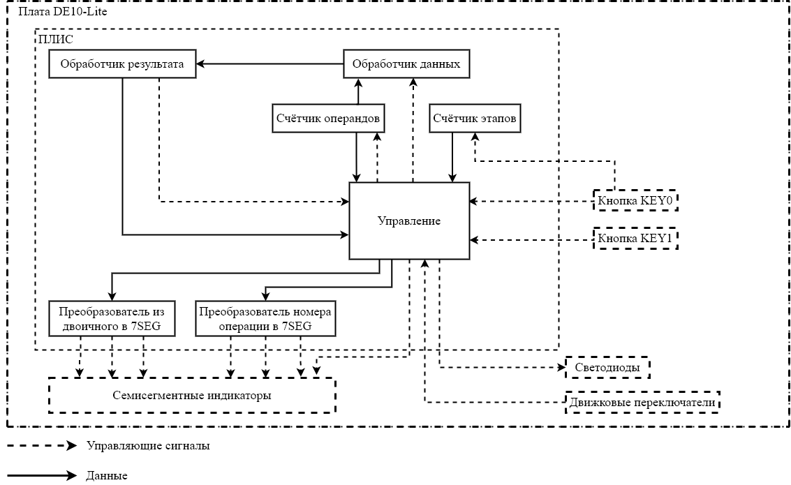
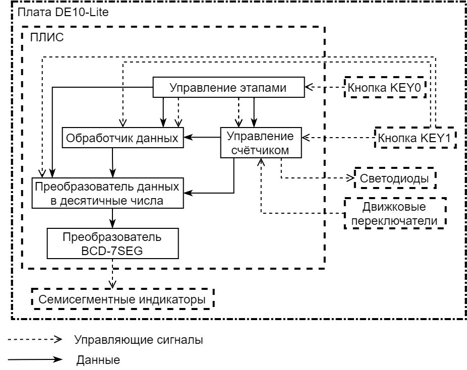

# DE10-Lite_calculator
Курсовая работа по дисциплине "Электроника и схемотехника", направленная на создание калькулятора для платы DE10-Lite.

В рамках курса данный проект является самым большим, но всё ещё остаётся учебным.
Калькулятор должен принимать на вход два числа, а также действие, которое необходимо с ними провести: сложение, вычитание, умножение и целочисленное деление.

## Два подпроекта

Калькулятор был реализован на двух разных языках с двумя разными концепциями. В первую очередь был разработан проект на языке VHDL в достаточно нестабильном варианте, а после на SV с большим пониманием всех процессов, которые закладывались в проект.

### 1. На языке VHDL

Концепция:  
  - При включении начинается 1й этап, на котором происходит выбор одной из четырех операций над числами (ADD – сумма, SUB – разность, MUL – умножение, DEL – целочисленное деление). Первая кнопка изменяет операцию, а вторая переводит на следующий этап.

  - На 2м и 3м этапах принимаются шестизначные числа, над которыми будет производиться выбранная операция. Будут использованы движковые переключатели для выбора разряда, который будет увеличиваться на единицу при нажатии первой кнопки. Активированный старший переключатель будет подсвечивать светодиод над собой за исключением самого первого, который будет отвечать за младший разряд. Вторая кнопка переводит на следующий этап.
    
  - На 4м этапе выводится результат. В случае, если результат суммирования или умножения выходит за рамки шести разрядов, то он будет отображаться в виде «бегущей строки», т.е. самый старший разряд результата будет выведен на первый семисегментный индикатор, а далее перейдет на второй, а вместо него встанет следующий по старшинству разряд результата. В случае, когда результат разности будет отрицательным, светодиод LEDR9 будет включён — это и будет означать, что результат отрицательный. Вторая кнопка переводит на первый этап.

### 2. На языке SV

Работа устройства подразумевает прохождение четырех этапов:  
  - Ввод первого компонента операции. На данном этапе требуется ввести число в пределах от 0 до 999999, так как на плате шесть семисегментных индикаторов, на которых, соответственно, будут отображаться разряды числа. При нажатии нижней кнопки платы, разряд числа будет увеличиваться на единицу, а сами разряды будут изменяться при помощи переключателей. При нажатии на верхнюю кнопку на плате будет фиксироваться введённый операнд и происходит переход на следующий шаг.
  
  - Ввод кода операции. Устройство поддерживает четыре операции такие, как сложение, вычитание, умножение и деление, соответственно обозначающиеся двоичным кодом 00, 01, 10, 11. При переходе на выбор действия, которое будет происходить с введёнными числами, поднимается один или два переключателя, где 0 – опущен, 1 – поднят, в соответствии с одним из вариантов двоичного кода. На семисегментных индикаторах будет отображаться двоичный код в зависимости от положения переключателей, то есть, например, при двух поднятых рычагах пользователь будет видеть соответствующую комбинацию цифр – 11. Верхняя кнопка платы будет отвечать за выбор операции, а нижняя — за переход на следующий этап.
    
  - Ввод второго компонента операции. На этом шаге действия выполняются аналогично первому этапу.
    
  - Вывод результата. Результат вычислений будет выводиться на семисегментных индикаторах. Так как при выполнении операции сложения и умножения получившийся результат может превышать максимум разрядов, то есть шесть, то путем нажатия нижней кнопки, можно будет двигаться между разрядами, тем самым появляется возможность просматривать остальные разряды. Верхняя кнопка будет возвращать на первый этап.

